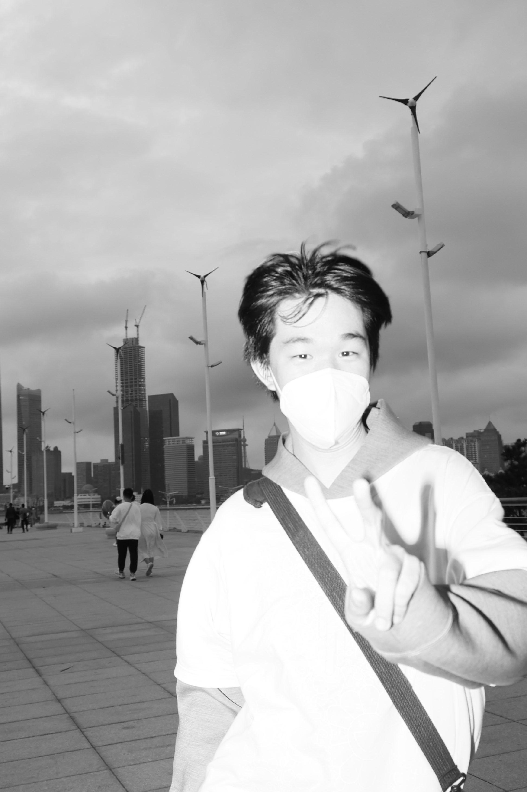

# A1m0nd-bao

### Building thoughtful interfaces for creative and AI-powered workflows.

I’m a frontend-focused builder exploring the space between product design, automation, and interactive media. I like turning rough ideas into small, useful tools with clear interfaces and a complete path from prototype to deployment.

- **Focus:** frontend products, creative tooling, AI-assisted workflows, and lightweight automation
- **Currently exploring:** Live2D production pipelines, mobile agents, motion studies, and practical AI interfaces
- **Based in:** China
- **Contact:** [bbbbbtr@foxmail.com](mailto:bbbbbtr@foxmail.com)

 

## What I work on

| Area | What it looks like |
| --- | --- |
| Product interfaces | Responsive web apps, interaction patterns, and polished prototypes |
| Creative tooling | Workflows for Live2D, motion, visual assets, and interactive experiences |
| AI automation | Agent experiments, service integrations, and reliable task pipelines |
| Shipping | GitHub Pages projects, small production services, and iterative delivery |

## Selected projects

### [Morph Live2D Workbench](https://github.com/A1m0nd-bao/live2d-automation-workbench)

An end-to-end production workspace for Live2D assets. It tracks the path from character reference image to layered PSD, Cubism project, and runtime model, with a FastAPI relay for durable asynchronous processing.

### [OpenGUI](https://github.com/A1m0nd-bao/OpenGUI)

An open-source AI mobile operator project exploring how agents can interact with Android apps for long-running, practical workflows.

### [OWCS Champions Clash Predictor](https://github.com/A1m0nd-bao/owcs-champions-clash-predictor)

A focused JavaScript prediction tool that turns match data into a simple, accessible experience.

### [Neon Hero Motion Study](https://github.com/A1m0nd-bao/neon-hero-motion-study) · [Loci Motion Preview](https://github.com/A1m0nd-bao/loci-motion-preview)

Small visual experiments for motion, composition, and interactive presentation.

## Tools I use

## Now

I’m building a stronger bridge between creative production and dependable software: interfaces that feel calm and intentional, plus the automation underneath them that makes the workflow repeatable.

If you’re interested in creative tools, AI agents, or thoughtful frontend work, feel free to [say hello](mailto:bbbbbtr@foxmail.com).
